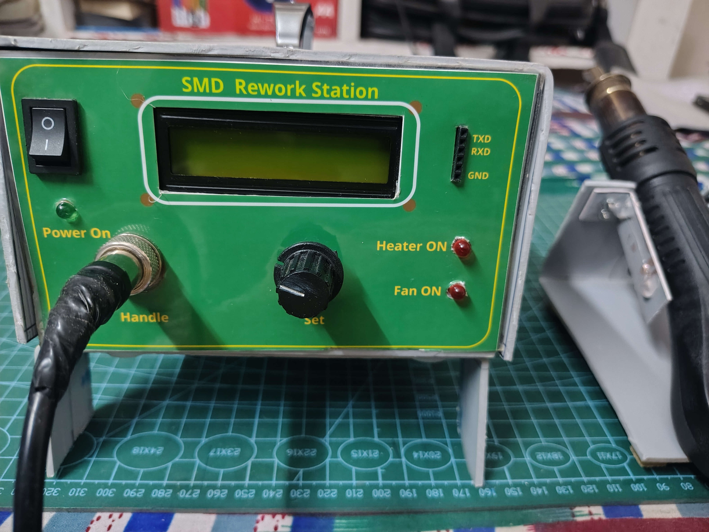
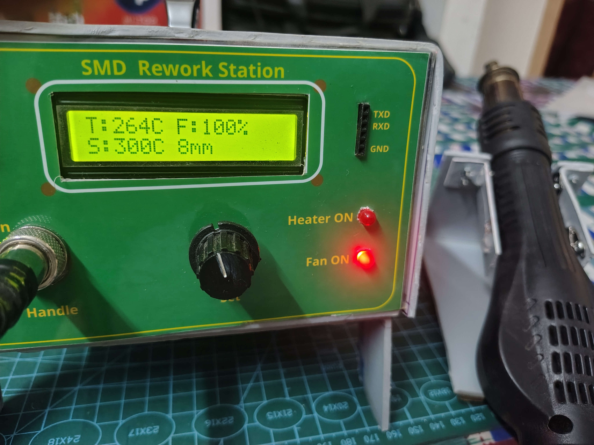
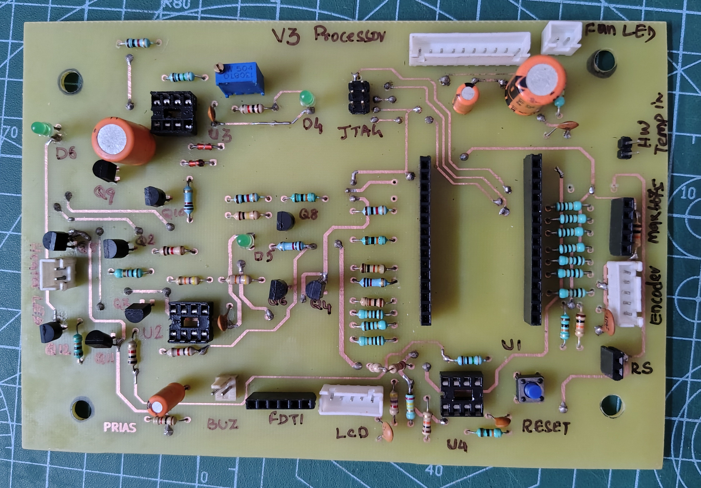
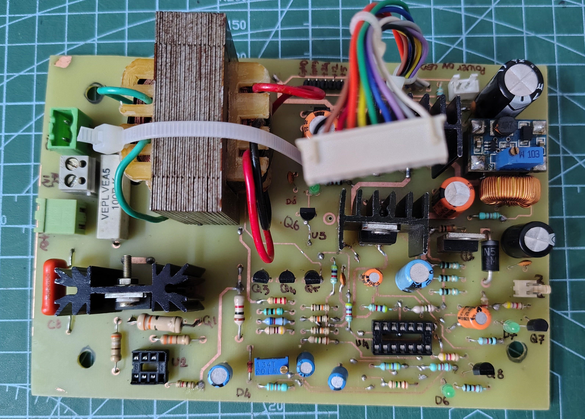
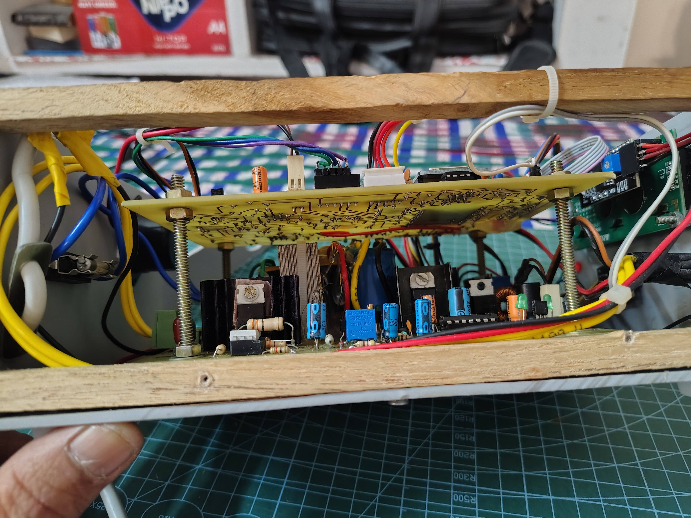
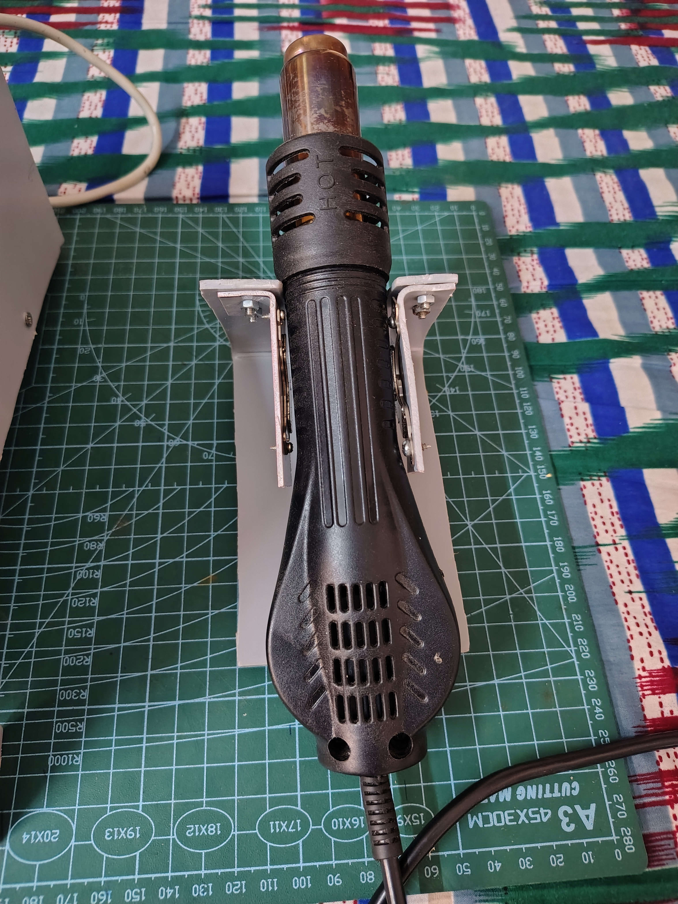

# SMD Rework Station (ESP32 Based)

Project repository:
https://github.com/snivasms/SMD-Rework-Station

---

<b><i> ESP32-based hot air **SMD rework station** designed for repair and rework of
surface mount devices using thermocouple feedback, PID control and
programmable airflow..</i></b>

---

## 🌐 Project Links

**Hackaday (Development Logs):**  
https://hackaday.io/project/205300

**Instructables (Step-by-step Build Guide):**  
https://www.instructables.com/DIY-ESP32-SMD-Rework-Station-With-PID-Control-and-/

**YouTube ( Demo video ):**
https://www.youtube.com/watch?v=VaSrfSvtFI0&t=310s

---

## Contents

- [Summary](#summary)
- [Warning](#warning)
- [Project Status](#project-status)
- [Block Diagram](#block-diagram)
- [Front Panel](#front-panel)
- [Project Overview](#project-overview)
- [System Details](#system-details)
- [Firmware Files](#firmware-files)
- [Hardware Components](#hardware-components)
- [User limits](#user-limits)
- [Hardware Safety Features](#hardware-safety-features)
- [Software Safety Features](#software-safety-features)
- [Features](#features)
- [Functional Description](#functional-description)
- [User Interface](#user-interface)
- [Assembly Notes](#assembly-notes)
- [Electrical Calculations](#electrical-calculations)
- [Takeaway Lessons](#takeaway-lessons)
- [Repository Structure](#repository-structure)
- [License](#license)

---

## Summary

| Item | Description |
|-----|-------------|
| Controller | ESP32 DevKit V1 |
| Firmware | MicroPython |
| Heater | 230 V / ~550 W |
| Fan | 24V BLDC |
| Temperature Sensor | MAX6675 K-type thermocouple |
| Display | 16×2 I2C LCD |
| Control | Rotary encoder |

## Build Difficulty

Intermediate → Advanced

Requires experience with:

- mains powered equipment
- PCB assembly
- MicroPython firmware

---

[⬆ Back to Contents](#contents)

# ⚠️ **WARNING**

 This project operates directly from **230 V AC mains**.  

 Improper construction may result in electric shock, fire hazard, or equipment damage.

 This design is intended for **experienced electronics builders only**.

Users must verify electrical safety, insulation, and
regulatory compliance before construction or operation.

---
[⬆ Back to Contents](#contents)

# Project Status
✔ Hardware verified
✔ Firmware stable
✔ PID tuning implemented
✔ Safety interlocks operational

---
[⬆ Back to Contents](#contents)

# Block Diagram

        +----------------+
        |   ESP32 MCU    |
        +--------+-------+
                 |
     +-----------+-----------+---------------+
     |                       |               |             
     MAX6675                Rotary Encoder   | 
     Thermocouple           User Input       |
     |                                       |
     Temperature                             |
                                             |
         +-----------------------------------+
         |
     ESP32 Outputs
         |
         +-------- Heater TRIAC (BT139)
         |
         +-------- Fan MOSFET (IRF540)
         |
         +-------- LCD display 

      +---------------+
      | 230 V AC 50 Hz |
      +---------------+
            |
            Transformer → Rectifier → 12 V → Boost → 24 V Fan
                                       |   
                                       5 V -> ESP32 Module
                          
---
[⬆ Back to Contents](#contents)

## Front Panel

## Electronics

## Internal Assembly

## Handle And Stand

---
[⬆ Back to Contents](#contents)

# Project Overview

This project implements a **temperature controlled SMD rework station** using an **ESP32 DevKit V1** running **MicroPython**.

The system controls:

- Hot air heater
- Airflow fan
- Temperature regulation using PID
- Nozzle specific calibration
- Safety interlocks for fan, temperature, watchdog and power supply health

---
 
[⬆ Back to Contents](#contents)

# System Details

| Item | Description |
|-----|-------------|
| Processor | ESP32 DevKit V1 |
| Firmware | MicroPython |
| Python Version | MicroPython v1.27.0 |
| Main Program | main.py V5.2 |

### Hardware Version

| Board | Version |
|------|--------|
| Power Board | V3 |
| Processor Board | V3 |

---
[⬆ Back to Contents](#contents)

# Firmware Files

After flashing MicroPython, the following files must be copied into the ESP32 file system:
- boot.py 
- main.py 
- i2c_lcd.py 
- lcd_api.py 
- rotary.py 
- rotary_irq.py 
- max6675.py 
- nozzles.json 

---
[⬆ Back to Contents](#contents)

# Hardware Components

| Component | Description |
|----------|-------------|
| Display | 16 x 2 LCD with I2C interface |
| Temperature Sensor | MAX6675 K type thermocouple |
| Input Control | Rotary encoder with push button |

### SMD Handle Assembly

The SMD handle contains:

1. Heater – 220 V (~500 W)
2. K type thermocouple
3. Built-in BLDC fan – 24 V / 2.6 W
4. Reed switch for in-stand detection

---
[⬆ Back to Contents](#contents)

# User Limits

| Parameter | Range |
|----------|------|
| Fan Speed | 30 % – 100 % |
| Temperature | 100 °C – 450 °C |

---
[⬆ Back to Contents](#contents)

# Hardware Safety Features

1. Heater will not switch on if fan is not running
2. Fan stall detection
3. Fan unplug detection
4. 5 V rail monitoring
5. Hardware watchdog timer monitoring processor
6. Hardware safe temperature limit at 500 °C
7. Heater cutoff when handle placed in stand
8. Hardware cooling if processor fails

---
[⬆ Back to Contents](#contents)

# Software Safety Features

1. Heater switches on only when fan is running
2. Watchdog LED indicates processor health
3. Minimum fan speed limit 30 %
4. Maximum fan speed limit 100 %
5. Temperature limits 100 °C – 450 °C
6. In-stand cool down and fan off temperature set at 70 °C
7. Fan OFF after additional 30 seconds cooling

---
[⬆ Back to Contents](#contents)

# Features

1. PID based temperature control
2. PWM fan speed control
3. Display shows:
   - Set temperature
   - Actual temperature
   - Fan speed
   - Selected nozzle size
4. Per nozzle calibration
5. Recalibration option during RUN mode
6. Front panel serial port for PC communication using FTDI module
7. New nozzles can be added
8. Unlimited calibrated nozzles
9. RUN mode possible without nozzle ( Bare handle )
10. Temperature and fan speed adjustable during operation
11. Reused nozzle starts with default temperature **250  °C**

---

# Troubleshooting LEDs

| LED | Function |
|----|----------|
| Power LED | ON when 12 V supply present |
| Temperature limit LED | ON when temperature < 500 °C |
| Watchdog LED | On when Processor resets the watchdog |
| Fan running LED |ON when fan is running normally |
| Fan connected LED | ON when fan connected and running above minimum speed |
| Processor power LED |ON when 5 V rail healthy |
| Fan ON LED |ON when Fan PWM output active |

---

# JTAG Connector

| Pin | Signal |
|----|------|
|1|TCK GPIO3|
|2|TDO GPIO15|
|3|TMS GPIO14|
|4|3.3 V|
|5|TDI GPIO12|
|6|GND|

---
[⬆ Back to Contents](#contents)

# Functional Description

## Fan Control

12 V unregulated supply feeds **SX1308 boost module** generating 24 V.

MOSFET **IRF540N** switches the fan using PWM command from ESP32.

Cooling sequence:

1. Fan runs when equipment powers up
2. Heater turns OFF immediately when handle placed in stand
3. Fan runs until temperature drops to **69 °C**
4. Fan stops **30 seconds later**

---

## Heater Control

Heater driven by **BT139 TRIAC**.

Heater activates only when:

- Fan running normally
- Fan above minimum speed
- 5 V supply healthy
- Watchdog control active
- Temperature below HW safe limit
- Processor command active
- Handle not in stand

---
[⬆ Back to Contents](#contents)

# User Interface

### Startup

Display shows **nozzle selection menu**

Encoder actions:

Rotate → scroll list of nozzles 
Short press → select nozzle and switches to RUN mode

Options include:

- Stored nozzles
- NEW nozzle
- NO NOZZLE

---

### RUN Mode

Display shows:

- Actual temperature
- Set temperature default value 
- Fan speed
- Selected nozzle

Temperature adjustment: rotate encoder

Fan speed adjustment:

Press encoder → change fan speed  
Press again → return to temperature control

---

# Calibration Mode

Steps:

1. Install new nozzle
2. Set airflow
3. Long press encoder (>3 seconds)
4. Lift handle from stand

Calibration begins automatically.

Initial calibration values:
Temperature : 250 °C
Fan speed : user selected

PID parameters are stored when calibration completes.

---
[⬆ Back to Contents](#contents)

# Assembly Notes

1. Both PCBs are double sided without plated vias.
2. Vias connected using solder jumpers.
3. IRF540 fan MOSFET requires no heatsink.
4. BT139 mounted on heat sink with insulation washer.
5. Fan current sensing uses 3 × 1 Ω resistors in parallel.
6. Fan current signal filtered using 1 kΩ + 10 µF.
7. Bulk capacitor increased to 5000 µF.
8. Additional wiring to SX1308 input improves 12 V supply stability.
9. Star ground used near transformer secondary.
10. Fuse rating 3 A.
11. MAX6675 mounted horizontally for enclosure fit.
12. FTDI module used for firmware development.
13. Hardware tested using spare ESP32 board with no processor.
14. MOC3041 socket used for testing with a LED for testing interlocks by inserting a suitable LED in socket pin1 and 2 ,without energising BT139.
15. High voltage area coated with insulation varnish.
16. The processor board was initially etched with a timer for fan off delay ( U3). With a little
    modification to the fan control , during assembly, U3 was omitted.
    
    However, the socket for U3 is still visible in the photograph. Since the modification was small and the board had already been assembled with U3, 
    
    to save time, the board was used with minor manual wiring changes. 

    However, the schematic and PCB files have been updated. 

---   
[⬆ Back to Contents](#contents)

# Electrical Calculations

## Heater Power
~~~
Heater resistance = 96 Ω ( measured using a DMM ) 

  Power = V² / R

Power = 230² / 96

Power ≈ 551 W

Heater current ≈ 2.4 A

Triac used:
BT139 (16 A rating)

Load utilisation ≈ 15 %
~~~
---

## Watchdog Timer 
~~~
555 monostable timing:
Rt = 94 kΩ
Ct = 4.7 µF
Pulse ≈ 486 ms

Minimum timing ≈ 369 ms

Watchdog reset interval used:
250 ms
~~~
---

## MOC3041 LED Drive 
~~~
Supply voltage  = 12 DC

Saturation voltages of
   Q3,Q4,Q5 ( power board)
   and Q2,Q3,Q11 ( Processor board)     = 6 x 0.2 = 1.2 V

Forward voltage drop of LED in MOC3041  = 1.2V

  Total drop                            = 2.4 V

  R4 in Power board                     = 1 K

  MOC3041 LED current                   = (12-2.4)/1K 

  MOC3041 LED current                = 9.6 mA
~~~
---

## Fan Current Sense Voltage 
~~~
Three 1 Ohms resistors are connected in parallel and placed in the 
low side of the IRF540N MOSFET.

 Equivalent resistance (parallel)              = 0.33 Ohms.

Measured fan current at 24 V DC supply           = 96 mA

Current sense voltage at 24 V DC                 = 96 *0.33 = 31.68 mV

~~~
## Hardware Temperature Limit 
~~~
Voltage gain of U4A ( LM358) = 1+(R28/R23)

                             = 1+ (240/10)
                             = 25

Thermocouple output voltage  = 41 uV/ °C

at 500 Deg C output voltage  = 41*500 = 20.5 mV

After amplification in U4A   = 20.5 x 25 = 512 mV

Input reference at Pin5 U4B  = (3.3/(R30+R31)) X R31

                        = (3.3/(24+4.7)) x 4.7 = 540 mV

Over temperature trip will act at = (540000/25)/41 = 527 °C
~~~
---
[⬆ Back to Contents](#contents)

# Takeaway Lessons

1. 12 V regulator is inserted between the DC output 12 V and 5 V regulator input to 
   minimise the temperature rise of 7805 on no loads. But when the system is 
   loaded, the 12 V output falls to about 10 V , still ok for the 7505 input.

2. Boost converter interaction was very dominant on the smoothing capacitor across 
   fan supply. 3 capacitor failures ( 220 uF, 63V ) noted. A series inductor from 
   the 24 V power line with a highspeed freewheeling diode across the fan DC input 
   and a TVS diode at the output of 24 V supply solved the issue.

3. The drop in 12 V DC was seen very much when the fan is operating at the beginning, 
   to the extent of resetting the processor module  was overcome by providing a 
   5000uF bulk capacitor in place of 1000 uF filter capacitor. To accommodate the size
   of the 5000uF capacitor in the available space, it was inverted and place. The
   connection to the board was taken with 0.5 sqmm copper wire from capacitor. 

# Points For Improvement

1. Transformer used: 230 V / 12-0-12 V @ 750 mA
2. No load DC voltage reaches 17–18 V
3. 12 V regulator added to reduce heat in 5 V regulator
4. Possible improvements:

- Increase transformer to **15-0-15 V**
- Increase bulk capacitor voltage rating to **35 V**
- Replace transformer supply with **12 V 2 A SMPS**

Further analysis required for ripple interaction with SX1308 and 5 V regulator.

---
[⬆ Back to Contents](#contents)

# Repository Structure
~~~
SMD-Rework-Station/  

      firmware/  
          main.py  
          boot.py  
          rotary.py  
          rotary_irq.py  
          max6675.py  
          i2c_lcd.py
          lcd_api.py

      hardware/
          schematics/ 
             power_board_schematic.pdf  
             processor_board_schematic.pdf

          pcb_layout/
             power_board_B_Cu_negative.pdf 
             power_board_F_Cu_mirror_negative.pdf 
             power_board_layout.pdf

             processor_board_B_Cu_negative.pdf
             processor_board_F_Cu_mirror_negative.pdf
             processor_board_layout.pdf

       images/        
          Assembled_unit.jpg 
          power_board.jpg
          processor_board.jpg
          handle_on_stand.jpg
          pvc_stand1.jpg
          pvc_stand2.jpg
          stacking_of_boards.jpg
          station1.jpg
          station2.jpg
          with_cover.jpg

       README.md
       LICENSE.md
~~~
---
[⬆ Back to Contents](#contents)

# License

This project (firmware, hardware design files and documentation)
is released under the MIT License.

Third-party drivers included in this repository retain their
original MIT licenses and are credited in this documentation.

---

## Third-Party Components
MAX6675 driver:

Copyright © original author.
https://github.com/BetaRavener/micropython-hw-lib.
License: MIT.

---

Rotary encoder driver :

Copyright © original author.
https://github.com/MikeTeachman/micropython-rotary.
License: MIT.

---

lcd_api and i2c_lcd driver :

Copyright © original author
https://github.com/dhylands/python_lcd
License: MIT

---

 [⬆ Back to Contents](#contents)

---

